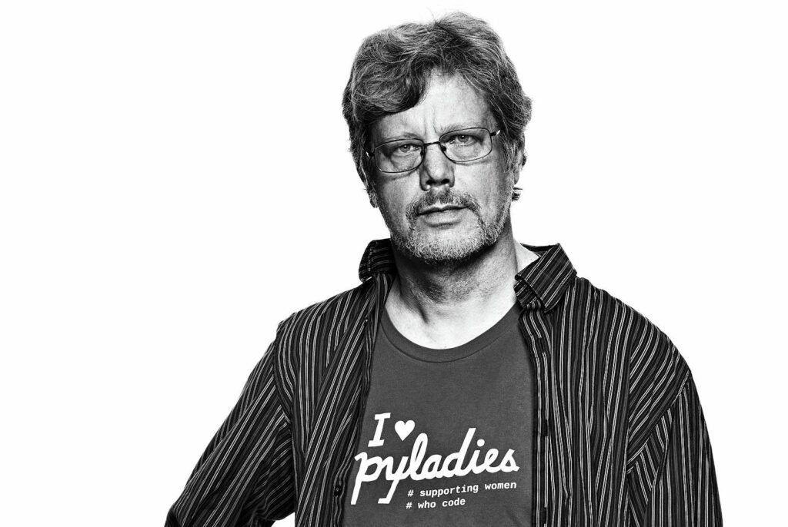

<meta property="og:image" content="https://socialify.git.ci/codeblues62/python-tutorials/png?description=1&descriptionEditable=Yuk%20Belajar%20Python%20dasar%20di%20seri%20Tutorial%20Python%20Bahasa%20Indonesia%20untuk%20pemula.%0A%0AAyo%20Belajar%20Python%20lewat%20seri%20Python%20dasar%20bahasa%20indonesia&language=1&name=1&owner=1&stargazers=1&theme=Auto" />
<meta property="og:image:width" content="1280" />
<meta property="og:image:height" content="640" />


-----------------------------------------------------

# Pendahuluan Python

[Python](https://python.org/) programming adalah bahasa pemrograman python yang merupakan bahasa  _**Hybrid**_ dengan cara menginterpretasikan dan bukan dengan cara kompilasi (Compiled) seperti bahasa pemrograman pada umumnya yang mengharuskan di kompilasi terlebih dahulu. Namun saat kita ingin menjalankan bahasa Python, kita tidak perlu melakukan kompilasi pada program kita dengan cara `python sourceFile.py` melalui _**Command Line Interface (CLI)**_, akan tetapi kita juga bisa melakukan kompilasi terlebih dahulu sebelum menjalankan programnya. Seperti: `python -m py_compile sourceFile.py` melalui _**Command Line Interface (CLI)**_.

## Siapa Pembuat Bahasa Pemrograman Python



[Guido Van Rossum](https://gvanrossum.github.io) adalah salah satu jagoan dari bahasa Pemrograman _**ABC & Modula+***_ yang merupakan bahasa pemrograman _Interpreted_. Pada tahun _1989_, guido van rossum bertemu dengan seseorang yang bernama _**Andrew S.Tenenbaum**_ dari **Vrije Universiteit Amsterdam** dan mengajak guido van rossum untuk membuat bahasa pemrograman amoeba (komputer), karena yang hanya diketahui oleh andrew s.tenenbaum bahwa guido van rossum sangatlah ahli dalam mendesain bahasa pemrograman. Semenjak pertemuan itu, mulailah proses untuk pembuatan bahasa pemrograman python seperti yang kita ketahui.
Lantas, Kenapa namanya harus _**Python**_? seperti nama ular saja. Karena guido van rossum sangat menyukai acara pertunjukkan sirkus yang di persembahkan oleh _**Monty Python**_ dan guido mengambil nama bagian belakang dari acara sirkus tersebut yakni _**Python**_.

## Kapan Bahasa Python Dirilis?
Bahasa pemrograman Python pertama kali dirilis pada _**Januari 1994**_ dengan versi _1.0_, lalu pada _**Oktober 2000**_ python meriliskan dengan versi _2.0_, kemudian pada _**Desember 2008**_ python merilis dengan versi _3.0_ dan memberikan **!Warning!** kepada python versi _2.x_ sampai akhir tahun _2020_ dan meninggalkan python versi _2.x_, kemudian python berfokus pada perkembangan python pada versi _3.x_ sampai seterusnya.

> _**Catatan**_: Versi-versi diatas hanyalah sebagian kecil yang kami berikan, untuk selengkapnya teman-teman bisa [kunjungi](https://www.python.org/doc/versions/) untuk membaca & melihat histori versi yang sudah terlewatkan.

## Apa Yang Membuat Bahasa Python Sangat Di Gemari?
Tentunya bahasa python dapat kita unduh secara Gratis dan bersifat Open Source, bahasa pemrograman python juga sangatlah multi Platform _**[Website, Mobile App, Desktop App, Game, Data Analyst, Data Science, Artificial Intelligence & Machine Learning]. Bukan hanya itu, bahasa pemrograman python juga sangat mudah untuk dibaca dan dipelajari oleh manusia karena penulisan sintaksnya yang sederhana jika di bandingkan dengan pemrograman lainnya.

## Apa Yang Membuat Bahasa Python Populer?
Ya pasti populer dong karena penulisan sintaksnya yang sederhana tanpa mmemberikan tanda titik koma (;) untuk mengakhiri setiap baris sintaksnya dan mudah untuk dijalankan tanpa perlu melewati kompilasi. Berikut ini adalah beberapa contoh penulisan sintaks sederhana untuk menuliskan program `Hello World!`:

### Python
```python
print("Hello World!")
```
### C / C++
```cpp
#include "stdio.h"

int main(int argc, char int *argv[]){
    printf("Hello World!\n");
}
```
### Java
```java
class Main{
    public static void main(String[] args){
        System.out.println("Hello World!");
    }
}
```
### PHP
```php
<?php
    echo "Hello World!";
?>
```
### Pascal
```pascal
program HelloWorld;

begin
  writeln('Hello World');
  readln;
end.
```

Untuk tutorial selengkapnya nanti teman-teman bisa masuk kedalam Directory / Folder yang telah disediakan, dan kami akan terus mengupdate tutorial selanjutnya..
